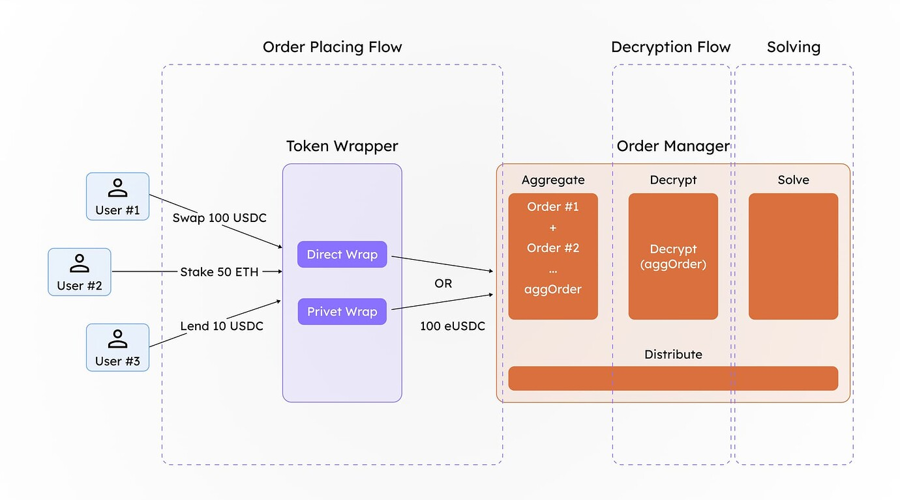
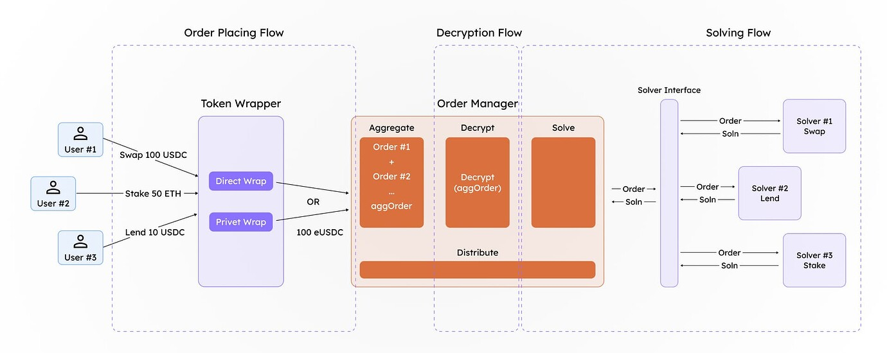

# Architecture
[This is the same text as our ETH Research Post](https://ethresear.ch/t/bringing-privacy-to-evm-applications-using-confidential-computing-via-co-processors/21217)

## Encrypted ERC20 Tokens
Encrypted ERC20 standard for privatizing user token balances. Any token balance intended for homomorphic computation on-chain would need to be wrapped within this encrypted ERC20 standard. This approach can serve as a foundation for building various privacy-focused solutions, such as private payments, private auctions, dark pools, and more.

This standard implements necessary interfaces which is used to implement necessary compliance checks, which include selective disclosure of specific ciphertext requested and a few other checks.

To learn more about Encrypted ERC20 you can read this article by Circle [3] 11

## Differential Privacy with Order Aggregation and Batch Settlements
We propose a solution leveraging differential privacy to enable order-solving for encrypted orders. This allows users to place encrypted orders (orders with encrypted tokens) and have them processed on-chain without revealing their details. External parties cannot determine the exact order details associated with a specific user.

Batching is a core component of this solution. The challenge with processing a single encrypted order directly through the protocol is that once decrypted, the amount the user intended to hide becomes visible. To mitigate this, we aggregate multiple orders using the additive homomorphic properties of certain privacy-enhancing technologies (PETs), such as Fully Homomorphic Encryption (FHE). The encrypted amounts are summed and deposited as an aggregated value with a designated manager. The manager’s role is to decrypt this aggregated value via a secure wrapper (obtaining the decrypted tokens amountIn values) so that the resulting assets can interact with the appropriate solver protocol.

By batching encrypted orders, we introduce a level of noise into each order, effectively preserving the privacy of individual users’ order details.

The design is inspired by Zswap DEX of Penumbra [5] 4, which uses sealed-bid batch swaps. The price at which these orders are settled is identical, as there is only one transaction per epoch.

Once the order is solved, the return token amount belonging to the user is calculated homomorphically using the ratio of the input amount to the output amount (the amount received upon solving the order). This calculation is performed homomorphically in the encrypted space, ensuring that no one can fully determine how many tokens a particular user will receive, thereby preserving privacy.

End to End flow Order placing → Order Aggregation → Order Solving → Distribution

