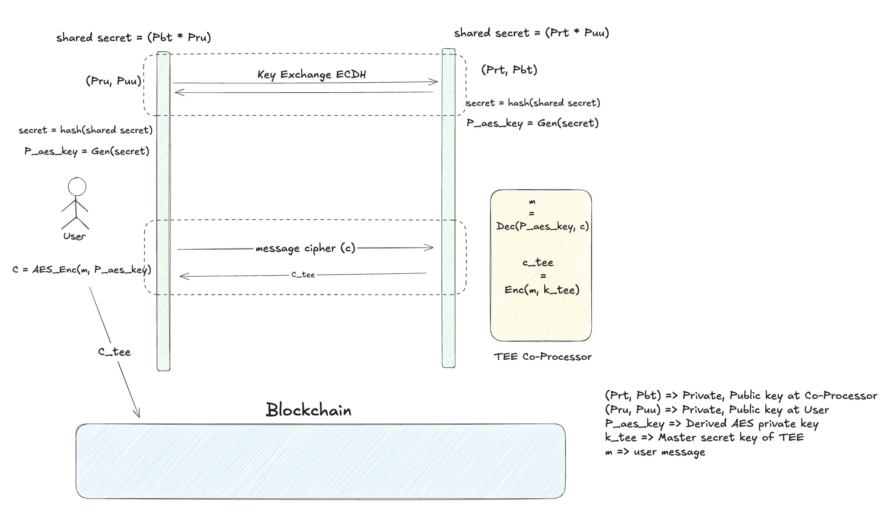
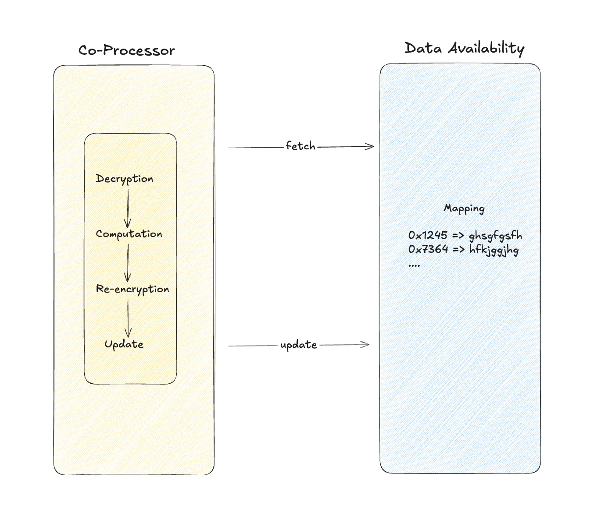

# PET Co-processor

### Functioning of TEE Co-Processor

The TEE co-processor leverages symbolic execution to perform ciphertext calculations efficiently. It operates alongside a full node, which continuously syncs in real time with the latest blocks produced on-chain. The full node sends requests to the co-processor to calculate the ciphertexts corresponding to those requests.

The Co-Processor consists of several components, each responsible for specific tasks:

### 1. Server-Side Encryption

Every ciphertext used in a smart contract must be encrypted with a master secret key, which the Co-Processor stores in its memory. This key is used to decrypt the ciphertext, perform the requested computations on the resulting plaintext, and update the resultant handle with the re-encrypted ciphertext.

To enable this, the Co-Processor engages in a shared secret setup mechanism (using ECDH). A shared secret is established between the client (who intends to encrypt the data) and the Co-Processor. Both parties derive the same AES encryption key from this shared secret. The client uses this key to encrypt the data, ensuring that it remains secure during transmission. Once the Co-Processor receives the ciphertext, it decrypts it inside the TEE using the shared key, re-encrypts it with the master secret key, updates the ciphertext mapping, and returns the relevant handle associated with this key.

### 2. Ciphertext Management

As mentioned earlier, we maintain a key-value mapping of handles to ciphertexts, enabling asynchronous ciphertext calculation. This mapping is stored publicly on a Data Availability (DA) layer, allowing anyone to fetch the ciphertext corresponding to a specific handle.

We also plan to make data availability sovereign, meaning applications will have the option to manage ciphertext data independently for their users.

### 3. Key Management System (KMS)

The Key Management System handles the shards of the secret key. These shards, when aggregated using an MPC (Multi-Party Computation) approach, can regenerate the secret key to perform decryption operations.

### 4. Access Control

Since our infrastructure enables computation, decryption, and re-encryption of on-chain public ciphertext, robust access control is essential. Unauthorized entities must be prevented from making computation, decryption, or re-encryption requests for ciphertexts.

Ciphertext access control is a critical feature, allowing application-specific compliance. Developers can define rules ensuring that ciphertexts generated in smart contracts are accessible only to regulated entities. These entities, for surveillance and regulatory purposes, can submit decryption requests through our compliance mechanism.

### 5. Ciphertext Computation

Ciphertext computation is the core of our infrastructure. Co-Processors run alongside the blockchain’s full node, listening for computation requests raised on-chain.

We’ve modified the full node to relay these requests. When the full node detects a computation request for certain handles, it forwards the request to the Co-Processor. The Co-Processor then fetches the ciphertexts corresponding to the input handles, performs the decryption, executes the requested computations, and calculates the resultant handle within the TEE. Finally, it re-encrypts the result and stores the final ciphertext under the resultant handle.