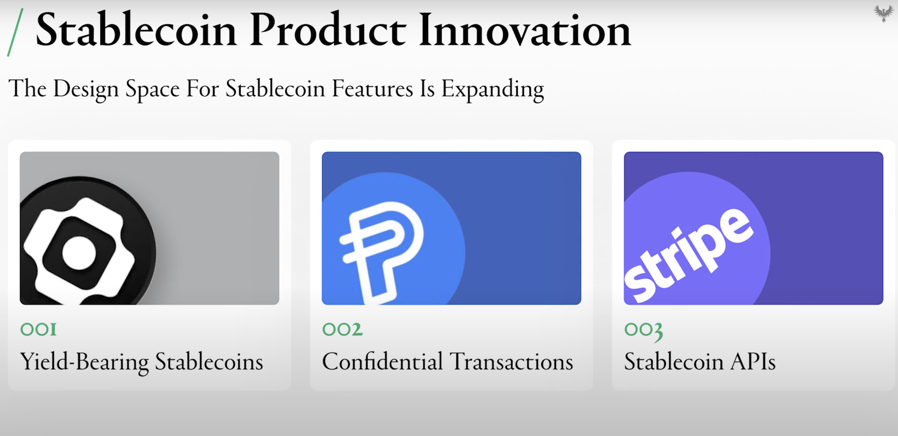

# Encifher

## What is Encifher ?

Encifher is a plug-and-play modular middleware that empowers DeFi apps with seamless, compliant privacy. 

By integrating directly with existing DApps and their liquidity, Encifher ensures users don’t need to change ecosystems, download additional wallets, or compromise on functionality.

In the core, Encifher uses these off-chain Privacy Enhancing Technology Co-processors, which allow the state to be represented in the smart contract as encrypted. 

### **How It Works**

1. Standard tokens (e.g., USDC) are seamlessly wrapped into private versions (eUSDC) with all ERC20 functionality intact.
2. Transaction batching adds noise to mask individual details while ensuring efficiency.
3. Off-chain cryptographic computations preserve blockchain performance.
4. Aggregate private actions (swaps, lending, staking) through a Uniswap-inspired structure.
5. Selective transparency through spending and viewing keys ensures regulatory alignment.

Your interaction with the chain is not anonymous, so people can see that you interacted with a DeFi protocol, but they cannot see how much you are interacting with. Think of it as Venmo where users can see who is sending whom but not the amount. 

Your Encrypted token balance is something that reveals nothing as its jibberish even when it's zero

Using Encifher’s privacy stack, a user can interact with the DeFi ecosystem:

- Privacy-enabled swaps in DEXs
- Private Lending in Money Markets
- Private transfers or payments through wallets
- Private payment SAFE modules for enterprises
- DAO Governance
### **Why Encifher?**

- **Effortless Integration:** DApps can integrate Encifher without altering smart contracts—only the interaction layer is updated.
- **Privacy Without Complexity:** Users gain encrypted swaps, lending, and yield strategies without sacrificing compliance or usability.
- **Regulatory Alignment:** Compliance is baked into the middleware, ensuring that neither DApps nor users need to manage it.