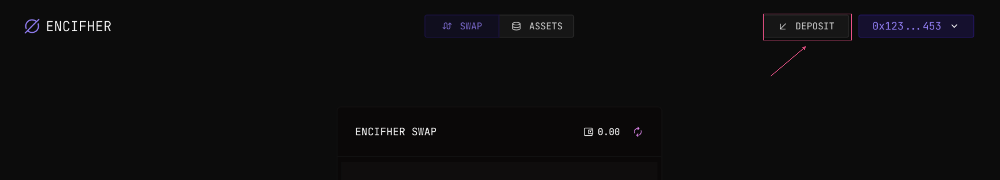
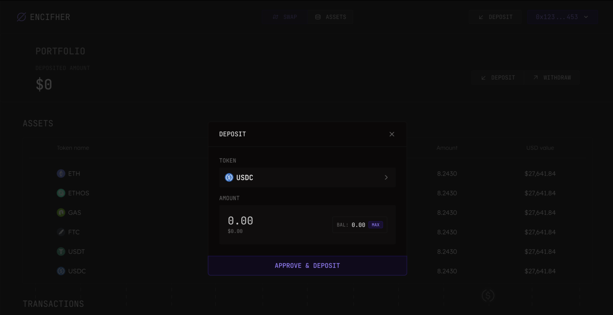
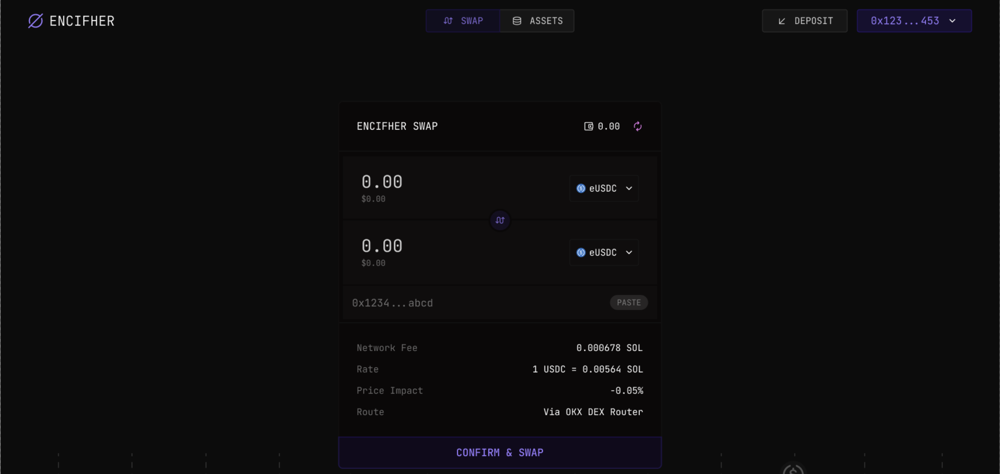
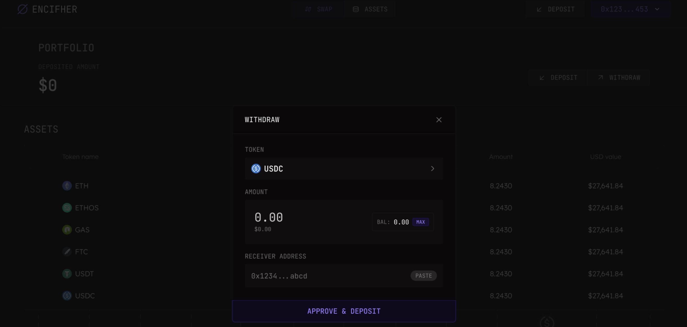

# How to Use Encifher to Trade Privately Over Jupiter

Encifher adds a privacy layer on top of Jupiter, Solana’s leading liquidity aggregator, allowing you to trade without exposing sensitive transaction details like strategy or size.

Here’s how to get started:

---

### Step 1: Deposit Funds into Encifher

After connecting your wallet, navigate to the **Deposit** section and make your first deposit.

> **IMPORTANT:** Always deposit an amount larger than the individual swaps you plan to make. This improves privacy guarantees by preventing direct linkability between deposits and swaps.

  <em>Deposit funds into Encifher</em>

  <em>Deposit modal</em>

---

### Step 2: Swap Privately Using Encifher + Jupiter

Go to the **Swap** section and select the asset pair you want to trade.

Under the hood, Encifher encrypts your swap orders and routes them through Jupiter — so while liquidity is sourced from Solana’s public DEXes, your trade amounts and strategies stay private.

  <em>Swap assets privately via Jupiter</em>

---

### Step 3: Withdraw Assets

When you’re ready to withdraw, you can move your assets to any wallet address of your choice.

> **IMPORTANT:** For better privacy, do not withdraw all assets at once. Instead, withdraw in parts to further obfuscate the link between your trading activity and your withdrawal.

  <em>Withdraw assets</em>

## Best Practices for Maximizing Privacy

To get the most out of Encifher’s privacy layer, follow these recommended practices:

### 1. Over-deposit relative to swap size
Always deposit an amount larger than the swaps you intend to perform. This prevents one-to-one matching between your deposit, swap, and withdrawal, improving privacy.

### 2. Stagger withdrawals
Avoid withdrawing your full balance in a single transaction. Instead, withdraw in smaller amounts over time. Using different wallet addresses for withdrawals can further reduce traceability.

### 3. Vary swap patterns
Avoid predictable patterns in your swaps. Vary both the timing and the size of your trades to make transaction graph analysis more difficult.

### 4. Use fresh withdrawal addresses
Where possible, withdraw assets to new wallet addresses. This adds an extra layer of unlinkability between your private trading activity and public wallet history.

### 5. Maintain a buffer balance
Keep a portion of your assets in your Encifher balance even after completing your trades. This avoids signaling clear start and end points to your activity.

---

By applying these practices, you can maximize the privacy of your on-chain trading activity when using Encifher.

---

