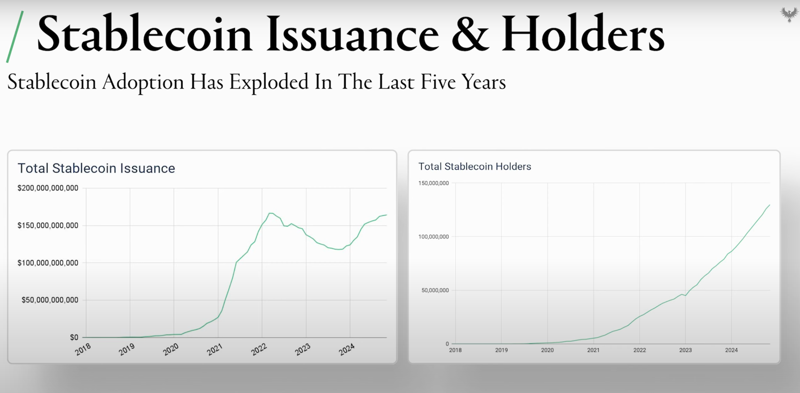
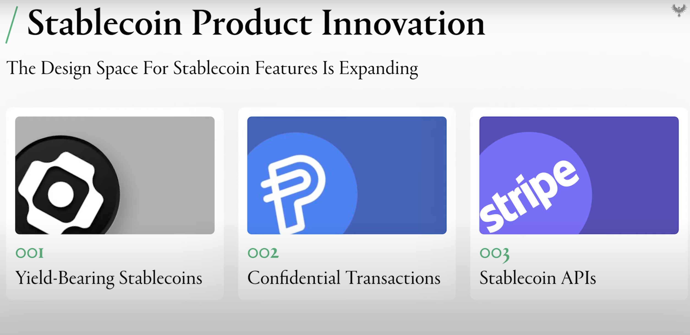

# P2P Payments

## Why Payments?

  <em>Total holders of stablecoins over the years [Source: <a href="https://www.youtube.com/watch?v=fQbf2zwRrk0">Multicoin Summit 2024</a>]</em>

Stablecoin payments are the backbone of crypto adoption and the biggest **Product-Market Fit (PMF)** in the industry. In **2024**, the stablecoin market reached a staggering **$200B** and is projected to **double by 2025**.

For merchants to fully adopt stablecoin payments in their day-to-day operations, **privacy on public blockchains** is a necessity. Here's why:

1. **Trust in Leading Chains**: 
   - Merchants trust chains like **Ethereum**, **Base**, and **Solana** for their **SAFE wallets** and robust infrastructure.

2. **Privacy for Financial Peace**:
   - Merchants need **privacy in their balance sheets**, ensuring their sensitive financial data is shielded while maintaining operational transparency.
   

  <em>Top 3 needs in stablecoins as identified by Multicoin Capital at the Multicoin Summit 2024.</em>

## Micro Payments Bot

Introducing the **Micro Payments Bot**, designed to address privacy concerns for small, everyday transactions. This bot allows users to send payments without exposing their addresses or transaction details on public blockchains.

### **Who is the User?**

#### **1. Day-to-Day Users (< $500 Transactions)**:
Everyday users who need a simple, private way to send small payments—whether splitting bills, gifting money, or paying for services.

#### **2. Degen Traders**:
- Traders who transfer funds between their wallets need to avoid creating **hard linkages** between addresses, protecting their strategies from being tracked or reverse-engineered.

#### **3. Businesses**:
- **Employers:** Businesses paying salaries want to avoid broadcasting how much they pay employees.  
- **Employees:** Workers don’t want their salaries visible on-chain for colleagues or competitors to see.

#### **4. Doxxed Whales**:
- High-net-worth individuals (**>$10K USD**) require privacy to avoid trackers, bots, and malicious actors monitoring their asset movements.

#### **5. Micro Payments to Friends**:
- Friends making small transfers don’t want their entire financial history revealed to senders, ensuring their balance sheets remain confidential.

### **Why Private P2P Payments Matter**

1. Protect sensitive transaction details and wallet balances from public scrutiny.

2. Privacy encourages businesses to adopt stablecoin payments without fear of exposing their financial data.

3. Prevent trackers and bots from targeting high-value users or exploiting on-chain data.

4. Make crypto transactions as seamless and intuitive as traditional payment methods like Venmo or PayPal.

### **The Future of P2P Payments**

The mass adoption of stablecoins hinges on combining the **trust of decentralized systems** with **privacy-first solutions.** By empowering users and merchants alike, private P2P payments represent a critical step forward in making crypto transactions secure, private, and user-friendly.

