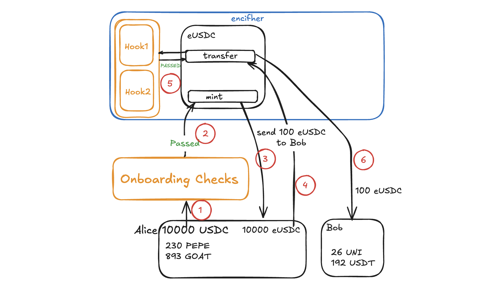

# How does Encifher handle compliance?

One very major issue while handling privacy is providing compliance guarantees at its core. Some users dont want that they should interact with tainted funds(which are invloved in hacks). 

Initially we will be having these kinds of preventive mechanisms for providing checks to remain compliant and follow regulations:

## Using List Providers

Current protocols are using solutions which check the availaboty of a transaction hash in a particular list. 

We will use different blockchain security and analytics protocols to balance security, compliance, and user privacy while preventing malicious activity in decentralized ecosystems. These will focus on detecting illicit activity, ensuring compliance, and improving security in the DeFi ecosystem. Services providing tools for tracking, risk assessment, and compliance.

These focus on cryptocurrency intelligence, compliance, and anti-money laundering (AML) solutions.

Encifher will use several mechanisms to ensure its ecosystem remains secure and free from misuse by bad actors. In addition to integrating external data providers, we will likely uses a combination of advanced analytics tools and internal measures to detect and prevent illicit assets from entering its pool.

## Pre Transaction Hooks

We can have different modules by regulatory bodies, which can contain rules defined according to their jurisdictions. 

On-chain compliance represents a preference for rules over standards as a form of legal policy. We post that rules should be preferred for financial regulation of Web3 environments: rules are forward-looking norms, setting a normative benchmark for behaviour before it occurs and thus letting subjects the freedom to plan ahead their course of action given the rules of the game while directing behaviour in the socially desired pattern prescribed. Programmatic enforcement by rigid, well-defined mechanical means can only support rules defined in great detail and in advance, rather than vague standards. 

A rule-based legal system allocates the discretion for the norm design to the rule maker, freeing users and developers from the expenditures involved in the discretion of standard interpretation. This is particularly valuable in Web3 when uncertainty and lack of clarity hinder innovation and progress by casting doubts on the legitimacy of the investment. Consider the difference between a standard “drive safely” and a rule specifying specific speed limits. Our lives proceed more efficiently because by relying on posted speed limits we spend less time calculating how fast to drive. Moreover, they prevent discrimination and bias by setting equal normative benchmarks for different parties, regardless of their background or their available resources. Rules could make Web3 regulation better, both from a fairness and efficiency perspective.

In fact, Web3 offers a promise for a fundamental shift in the rule-making methodology for the future of money. Emerging technologies now allow blockchains to enforce policies ex-ante by coding rules into the core payment infrastructure, providing normative boundaries for their use. On-chain compliance could set a normative benchmark for blockchain transactions, granting users and developers the freedom to plan ahead their course of action given the predetermined and clear rules of the game. Programming policies to the chain for automated enforcement can enhance ideas of self-reliance and nonintervention, consistent with the ethos of the emerging decentralized arena of Web3: by setting social norms in great detail and in advance, society creates a specific benchmark for adherence and poses a choice for users whether to comply or bear the costs.

### Pre-Transaction Rules Enforcement Using Programmable Privacy

Programmable privacy provides a robust framework for enforcing regulatory compliance through **pre-transaction rules**. This is particularly useful in systems utilizing encrypted ERC-20 tokens, where issuers can define and enforce rules that users must comply with before executing transactions on the blockchain. These rules ensure that the transaction adheres to legal and regulatory frameworks while preserving user privacy.

### What Are Pre-Transaction Rules and Who Defines Them?

Pre-transaction rules are conditions enforced by regulatory bodies to ensure that transactions align with applicable laws. These rules can range from simple conditions, such as limiting transaction amounts to $10,000 USD, to more complex checks like verifying a user's age or nationality using decentralized identifiers (DIDs). Trusted entities, such as government agencies or KYC providers, are responsible for defining and coding these rules.

### Implementation: Hook and Wrapper Smart Contracts

WIP 

## User Reputation Score

WIP
