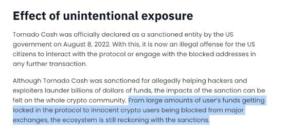

# What Are Privacy 1.0 Solutions?

Privacy has always been a hot topic in the crypto space. The first serious attempts at privacy-friendly solutions date back to 2013 with the launch of **Monero**, and even earlier, there were whispers of privacy enhancements for Bitcoin itself. While Bitcoin’s privacy aspirations were eventually shelved, other projects took the lead.

## The Early Days of Crypto Privacy
- **Monero:** The OG of privacy coins. Launched in 2013, it gained attention for its use of ring signatures, stealth addresses, and confidential transactions. 
- **ZCash:** The next big milestone. ZCash brought the power of zk-SNARKs to crypto, making private transactions practical and secure. It became a significant player after Monero.
- **The Ecosystem Grows:** Following these pioneers, a wide range of privacy-focused projects emerged, experimenting with:
  - **Shielding Pools:** Privacy through grouped transactions.
  - **Stealth Addresses:** Making recipient addresses invisible to outsiders.
  - **ZK Proofs:** Leveraging zero-knowledge technology to ensure privacy without compromising security or usability.

## The Problem with Privacy 1.0
Despite their potential, many of these early protocols faced significant challenges that limited their adoption:

1. **Compliance Woes:**
   - Many early privacy protocols ignored regulatory considerations entirely.
   - This lack of compliance attracted sanctions, legal scrutiny, and warnings from governments worldwide, creating "disastrous situations" for users and developers alike.

2. **Poor User Experience (UX):**
   - Using these services was often a nightmare—complex interfaces and unintuitive workflows scared users away.
   - The result? A mass migration of users to simpler, non-private options on chains with higher TVL.

3. **Sanctions and Fallout:**
   - People lost access to their funds due to sanctions on privacy protocols.
   - Users interacting with sanctioned accounts were denied airdrops or had their centralized accounts banned.

# Users faced a lot of issues with Privacy 1.0 solutions

Here’s why Privacy 1.0 didn’t quite get main stream:

### **Regulatory Issues**
- **Fear Factor:** Governments cracked down on privacy protocols, scaring off potential users.
- **Lost Funds:** Some users lost access to their crypto due to sanctions on protocols like Tornado Cash.

- **Airdrop Denials:** Imagine interacting with a protocol and then missing out on rewards because it got flagged. Ouch.
- **Account Bans:** Centralized exchanges and wallets often shut down accounts that interacted with privacy protocols.

### **User Experience (UX) Problems**
- Let’s face it: nobody wants to read a manual to send a private transaction. Early privacy protocols were complicated and unfriendly.
- **Result:** Users flocked to easier solutions, even if it meant sacrificing privacy.
