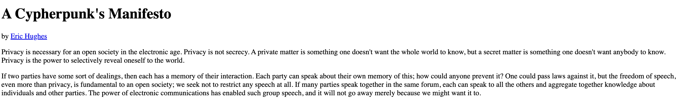
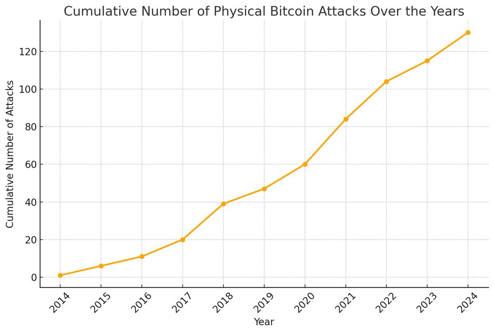

# Why On-Chain Privacy is the Missing Piece

Blockchain and DeFi systems are celebrated for their transparency and decentralization, but this openness comes at a cost—public exposure of user transaction data, leading to privacy vulnerabilities.

This trade-off between transparency and privacy contradicts the foundational ethos of the cypherpunk movement, which has long championed privacy as an integral part of digital freedom.

Cypherpunks were pioneers in advocating for and building privacy-preserving tools like cryptography, anonymous communications, and privacy-focused currencies, laying the groundwork for a trustless digital ecosystem.

Privacy holds a foundational importance to cypherpunks as it aligns with their ethos of individual freedom, resistance to centralized control, and the empowerment of individuals in a digital world. 

Originally, cypherpunks viewed privacy not as a privilege but as an essential human right. In their philosophy, privacy ensures the protection of individuals against surveillance, coercion, and exploitation.

Eric Hughes articulated this clearly in "A Cypherpunk’s Manifesto" (1993), stating:
"Privacy is necessary for an open society in the electronic age."

This lack of privacy introduces significant risks:

- **Deterrence for Privacy-Conscious Users:** Users who value confidentiality may avoid engaging with blockchain ecosystems entirely.
- **Security Vulnerabilities:** Public visibility of transactions opens doors to exploits such as front-running attacks and MEV (Maximal Extractable Value) manipulation.
- **Physical Threats:** Physical attacks, such as five-dollar wrench attacks, highlight the risks of inadequate privacy protections, where public transaction data makes users vulnerable to coercion and theft.

This chart illustrates the growing prevalence of physical attacks, underscoring the urgency for robust privacy measures.

For a detailed record of physical attacks on cryptocurrency holders, see [this comprehensive list](https://github.com/jlopp/physical-bitcoin-attacks/blob/master/README.md).

### The Overlooked Pillar of Open Source

Privacy, a cornerstone of the open-source ethos, is often overlooked in the design of dApps. 

Despite billions of dollars locked in ecosystems like Ethereum, Solana, and Bitcoin, privacy solutions remain an afterthought, leaving users exposed to significant risks and limiting DeFi's potential for mass adoption.
